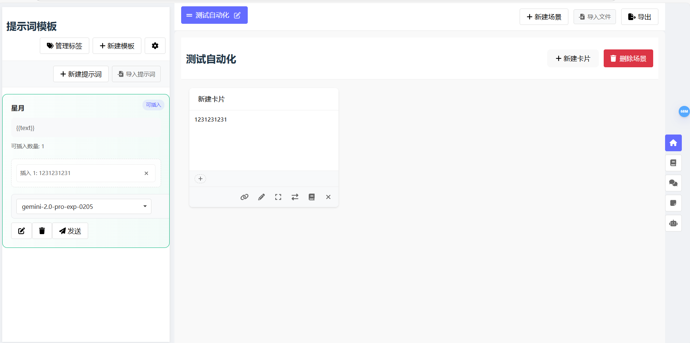

# 星卡写作 (AI Prompt Editor)

一个现代化的、功能丰富的提示词编辑和管理系统，基于 Vue 3 + Vite 构建。该系统允许用户创建、编辑和管理 AI 提示词，支持场景管理、文本卡片和智能工作流。

**版本号：0.9.3**



## ✨ 主要特性

- 📝 多场景管理：支持创建多个场景并在场景间自由切换
- 🗂️ 文本卡片系统：灵活的卡片式布局，支持拖拽排序和卡片关联
- 🤖 智能工作流：支持创建和管理AI任务流程支持创建和管理AI任务流程
- 🏷️ 标签管理：支持为卡片添加标签，包括普通标签和关键词标签
- 📤 导入导出：支持文本文件(.txt)、Markdown(.md)和 JSON(.json)格式的导入导出
- 🎯 提示词模板：支持创建和管理提示词模板，可插入文本内容
- 🔗 卡片关联：支持多卡片关联，关联内容自动合并
- 🎨 现代化 UI：简洁优雅的界面设计，流畅的交互体验
- 📱 响应式设计：适配不同尺寸的屏幕和设备
- 📚 拆书工具：提供智能拆书和批量处理功能
- 💬 智能聊天：支持多模型对话，自动关联卡片内容，智能拆分卡片

# 版本更新内容:
<details open>
<summary>0.9.3.1</summary>

1. 修复了场景无法切换的bug
2. 修复了拆书功能无法保存的bug

### ⚠️注意：

1. 拆书功能有点问题还没有修复！
2. 若还有bug请到QQ群即使反馈给群主！
3. 当前是第一次优化修复大量问题的版本，第二次估计得很后面，除非出现功能丢失等重大问题才会进行全面修整。
4. 小版本迭代（新功能demo，UI优化调整，小功能修复，新bug（bushi））都在Test分支，会实时不定时更新。
</details>

<details>

<details>
<summary>0.9.3</summary>
1. 首页js代码进行封装，优化请求等，提升了速度，并且存储逻辑也进行了统一，丢失概率大大下降。
2. 优化了对话的请求逻辑，同样进行了封装，对话时候不会重复发送system，切换提示词只是切换system。
3. 修复了大量请求问题，统一了请求逻辑。
4. 修复了ollama，LM拉取模型，请求失败问题。
</details>

<details>

<summary>0.9.2</summary>

1. 增加了版本号
2. 修复刷新后无法本地保存接口数据的bug(经量不要疯狂按f5刷新)
3. 增加对话轮数，自定义
4. 增加提示词导入功能
5. 修复标签功能
6. 修复章纲转换为卡片时，无法选择目标场景的bug（同时无法选中所有卡片转化为场景卡片功能）
</details>


## 🚀 快速开始

### 环境要求

- Node.js >= 16.0.0
- npm >= 7.0.0

### 安装步骤

1. 克隆项目到本地：

```bash
git clone https://github.com/XingQiPan/card-creation.git
cd card-creation
```
一、第一种方式

2. 安装依赖：

card-creation\

```bash
npm install
```

backend\

```bash
npm install
```

3. 运行开发服务器：

card-creation\
```bash
npm run dev
```

backend\

```bash
node server.js
```

二、第二种启动方式

card-creation\
```bash
start-dev.bat
```

注意：
默认两种方式都是安装好NodeJS的，如果未安装请先安装NodeJS

打开浏览器访问 http://localhost:8888

三、第三种启动方式

下载exe运行程序

路径：分支[山河-GO-exe](https://github.com/XingQiPan/card-creation/tree/shanhe-go-exe)

在群文件也可以下载


## 🛠️ 技术栈

- [Vue 3](https://vuejs.org/) - 渐进式 JavaScript 框架
- [Vite](https://vitejs.dev/) - 下一代前端构建工具
- [Vuedraggable](https://github.com/SortableJS/Vue.Draggable) - 拖拽组件
- [Font Awesome](https://fontawesome.com/) - 图标库
- [Marked](https://marked.js.org/) - Markdown 解析器
- [DOMPurify](https://github.com/cure53/DOMPurify) - XSS 防护
- [Pinia](https://pinia.vuejs.org/) - 状态管理

## ⚠️ 注意事项

- API 地址配置：
  - Gemini API: `https://generativelanguage.googleapis.com/v1beta/models/{模型名称}:generateContent`（最新版本只需要输入模型名字就好了）
  - OpenAI API: 自动附加 `/chat/completions` 符合openai格式都可
  - Ollama API: `http://localhost:11434` 拉取模型，拉取后选择自己想要的模型
  - custom API: 自定义API，请确保API地址正确（完整），填入对应api模型
  - 阶跃星辰 API: 拉取选择对应模型
  - 请确保 Ollama 服务已正确启动
  - 支持拉取模型列表，请确保模型支持拉取列表服务，若有问题可以用自定义API（需要输入完整地址）
- 关键词标签：使用关键词标签的卡片内容会在提示词中被检测并自动注入相关上下文
- 卡片关联：关联的卡片内容会在插入提示词时自动合并
- 拖拽优化：场景和卡片拖拽时不会干扰文本选择
- 拆书功能：支持断点续传，可以导入之前的进度继续处理

## 🤝 贡献指南

欢迎提交 Issue 和 Pull Request 来帮助改进这个项目！

1. Fork 这个项目
2. 创建特性分支 (`git checkout -b feature/AmazingFeature`)
3. 提交改动 (`git commit -m 'Add some AmazingFeature'`)
4. 推送到分支 (`git push origin feature/AmazingFeature`)
5. 开启 Pull Request

### 贡献列表

- [IssaCic0](https://github.com/IssaCic0)
- [山河](https://github.com/shanheinfo)

## 📧 联系方式

如果你有任何问题或建议，欢迎通过以下方式联系：

- QQ群：1028368820
- 教程：

1、[【逆天，一步操作，写作10倍效率——《星卡基础教程》】](https://www.bilibili.com/video/BV1WdPFegEpt/?share_source=copy_web&vd_source=92632bab5e8514b32ea9f54b8f6199a1)
本教程虽然才过了几天，但是已经与最新版本有较大差异，可以在本视频了解对应功能。
有问题优先进群问，我后期会出新视频同步更新到这里。

---

如果这个项目对你有帮助，欢迎给一个 ⭐️ Star！

默认开源协议是GPL协议，如果需要商用请联系我。
